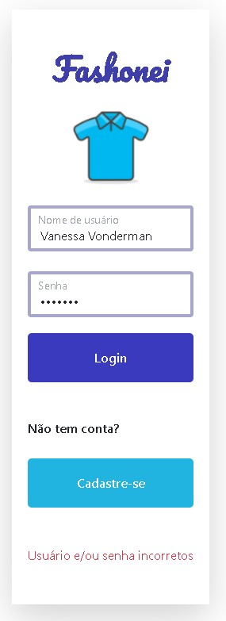
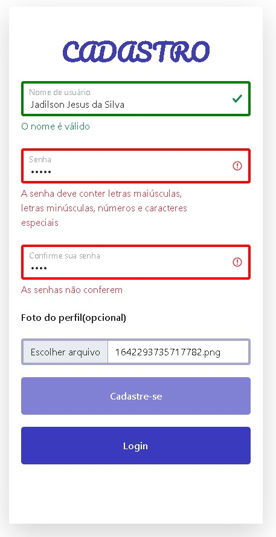
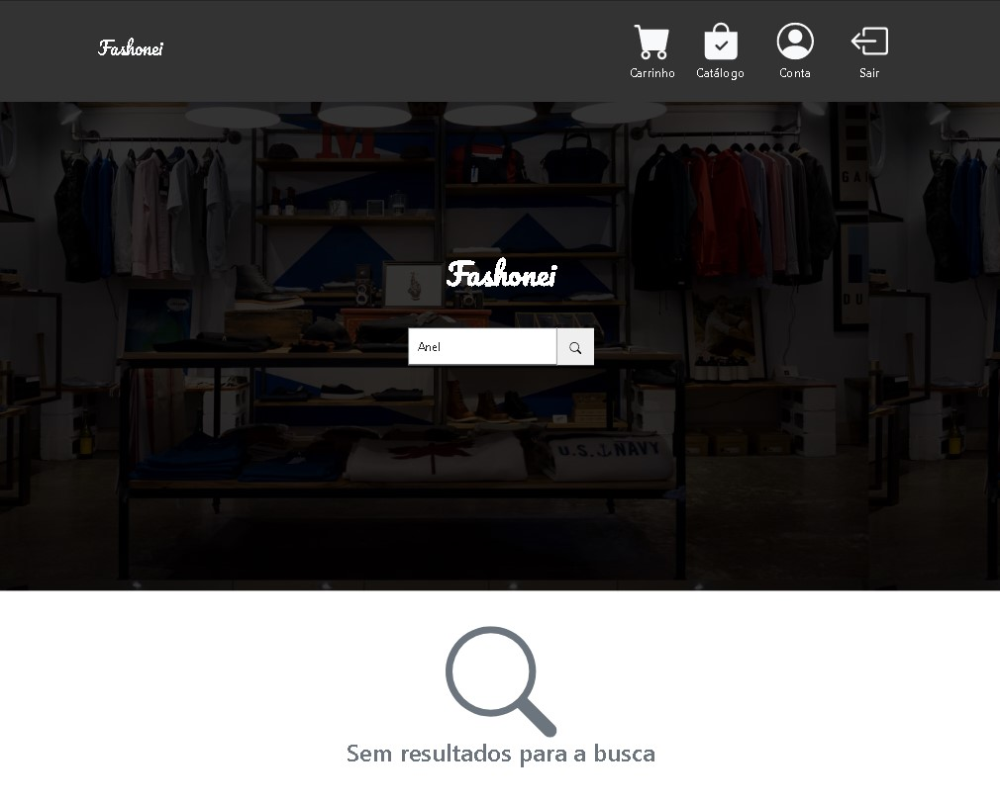
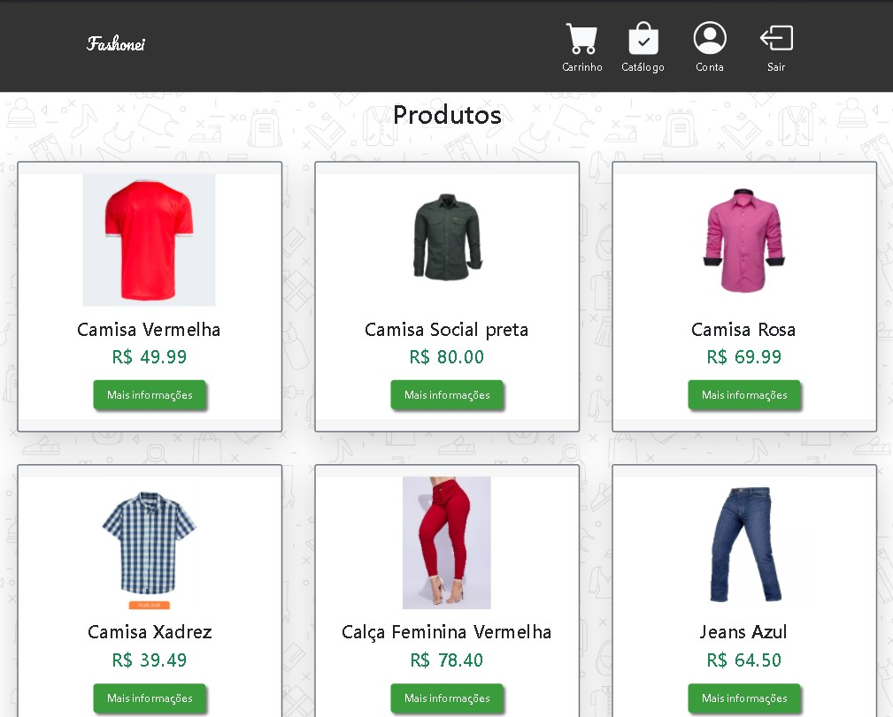
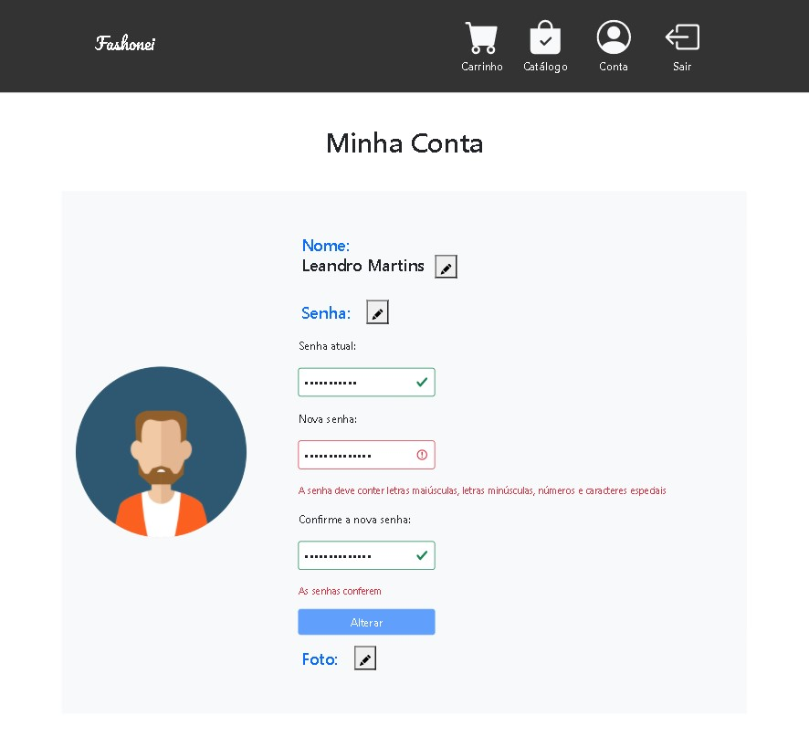
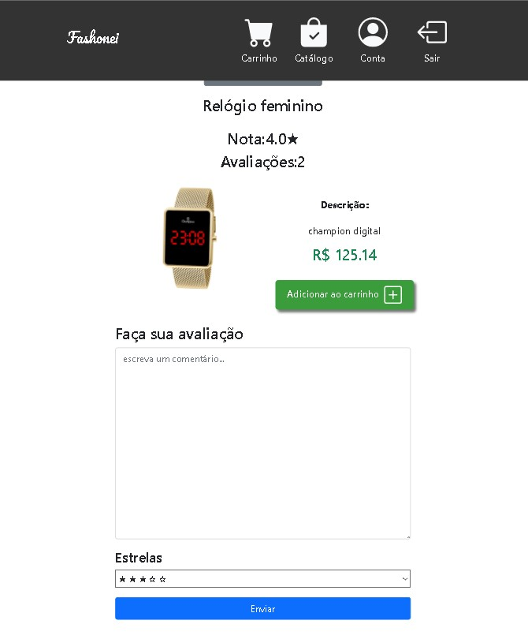
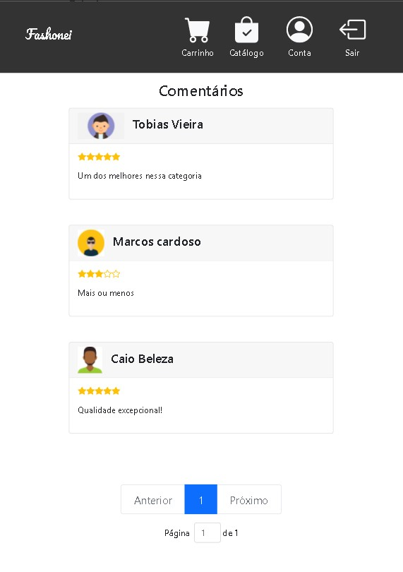

# Fashonei

Um projeto desenvolvido com o intuito de praticar integrações de APIS com React
O projeto possúi uma temática de loja de roupas no estilo e-commerce

# Screenshots















# Instalação:
+ Esse projeto necessita de MySQL para funcionar.
+ para instalar o projeto, entre na pasta Database e execute o script no seu SGBD.
+ Entre no arquivo .env dentro da pasta Backend e coloque as credenciais do seu banco de dados, coloque também o caminho da pasta raiz do projeto(a pasta onde se encontra este README)
+ não se esqueça de abrir o terminal e executar o ````npm install```` para instalar as dependências nas pastas  'Backend' e 'Frontend'

para executar o projeto, basta abrir duas janelas no terminal e executar:
```` cd Backend````
```` npm run start ````

```` cd Frontend````
```` npm run start ````
